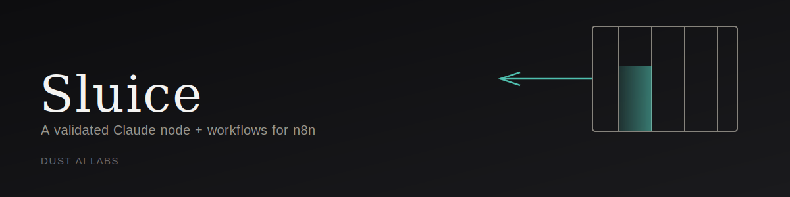

# Sluice

[](https://github.com/dustailabs/Sluice/actions/workflows/ci.yml)
[](LICENSE)
[](https://www.typescriptlang.org/)
[](https://n8n.io/)

**Low-code LLM automation: a custom n8n node that calls Claude and only
ever passes through JSON that matches your schema — plus three real
workflows built on top of it.**

Sluice is for the half of automation work that doesn't need a custom
backend. It ships **n8n-nodes-sluice**, a community node ("Claude
Structured") that calls Claude, validates the response against a JSON
Schema you define, automatically asks Claude to fix anything that fails
validation (up to a configurable retry limit), and routes the result to
one of two outputs — **Validated** or **Failed Validation** — so a bad
response never silently flows downstream as if it were good data.

Built by [Dust AI Labs](https://github.com/dustailabs) as the low-code
counterpart to [Relay](https://github.com/dustailabs/Relay) (the
Java/Kafka version of the same idea) — same principle, different end of
the build-vs-buy spectrum.

---

## How it works

```
   Input items
        │
        ▼
┌──────────────────┐
│ Claude Structured │  calls Claude with your system/user prompt
└──────────────────┘
        │  raw text response
        ▼
┌──────────────────┐
│  Parse + Validate │  against your JSON Schema (ajv)
└──────────────────┘
        │
   ┌────┴────┐
   │ valid?  │
   └────┬────┘
   yes  │   no → retry with a corrective message, up to Max Retries
        │            │
        ▼            ▼ (retries exhausted)
   Validated    Failed Validation
   (output 0)     (output 1)
```

On a retry, the node doesn't just resend the same prompt — it appends
Claude's bad response plus a message listing exactly which schema rules
it broke, the same "tell it what was wrong, not just try again" pattern
Cairn uses for citation validation.

## Project structure

```
nodes/ClaudeStructured/
  ClaudeStructured.node.ts  — the node: execute() loop (call → validate → retry/route)
  GenericFunctions.ts       — the only function that touches the network (mocked in tests)
  validation.ts             — framework-free JSON parsing + ajv schema validation, tested standalone
credentials/
  AnthropicApi.credentials.ts — x-api-key / anthropic-version header auth
workflows/
  ticket-triage.json        — webhook → classify → route by priority to Slack channels
  lead-enrichment.json      — webhook → enrich lead → CRM upsert → flag high-intent leads
  content-repurposing.json  — webhook → long-form content → tweet variants + LinkedIn post
test/                       — Jest, fully offline (network call mocked, no API key required)
```

## Installing the node

```bash
npm install n8n-nodes-sluice
```

Or for a self-hosted instance without npm-publishing it first:

```bash
git clone https://github.com/dustailabs/Sluice.git
cd Sluice && npm install && npm run build && npm link
cd ~/.n8n/custom && npm link n8n-nodes-sluice   # restart n8n after
```

Then add an **Anthropic API** credential (your API key) and drop the
**Claude Structured** node into any workflow.

## Using the bundled workflows

Each file in `workflows/` is a standard n8n export — import it directly
(Workflows → Import from File) and wire up your own Slack/CRM credentials:

- **`ticket-triage.json`** — classifies inbound support tickets by
  category and priority, routing priority-4+ tickets to an urgent
  Slack channel and everything else to the regular queue.
- **`lead-enrichment.json`** — infers industry, company size, and a
  conservative buying-intent score from an inbound lead form, upserts to
  your CRM, and flags high-intent leads in Slack.
- **`content-repurposing.json`** — turns a long-form post into three
  tweet variants and a LinkedIn post, instructed to stay factual to the
  source rather than invent statistics or quotes.

## Testing

```bash
npm install
npm test
```

30 tests, fully offline: `validation.ts` (JSON parsing, ajv schema
validation, retry-message formatting) is tested as plain TypeScript with
zero n8n or network dependency; the node's `execute()` retry/routing
loop is tested with `callClaude` mocked so no real Anthropic call ever
happens; and every file in `workflows/` is checked for structural
correctness (valid node/connection references, valid embedded JSON
Schemas) so a typo in a bundled workflow fails CI instead of failing
silently on import.

## Extending Sluice

- **A different LLM provider**: `GenericFunctions.ts` is the only place
  the Anthropic endpoint is named.
- **Different validation behavior**: `validation.ts` is framework-free —
  change it without touching the node's retry loop.
- **A new bundled workflow**: see [`CONTRIBUTING.md`](CONTRIBUTING.md).

## License

MIT — see [LICENSE](LICENSE).

---

## About Dust AI Labs

Dust AI Labs is an AI engineering consultancy. We architect, build, and ship
production GenAI systems — agentic pipelines, retrieval-augmented knowledge
platforms, and LLM-driven automation — for FinTech, Healthcare, E-Commerce,
LegalTech, and Enterprise SaaS clients. Every engagement is built end-to-end
by a single senior practitioner: no offshoring, no junior pass-through.

Sluice is one of several open-source reference builds — see the [full profile, case studies, and engagement models →](https://github.com/dustailabs)

**Get in touch:** <dustailabs@proton.me> · [book a discovery call](https://calendly.com/dustailabs-proton)
